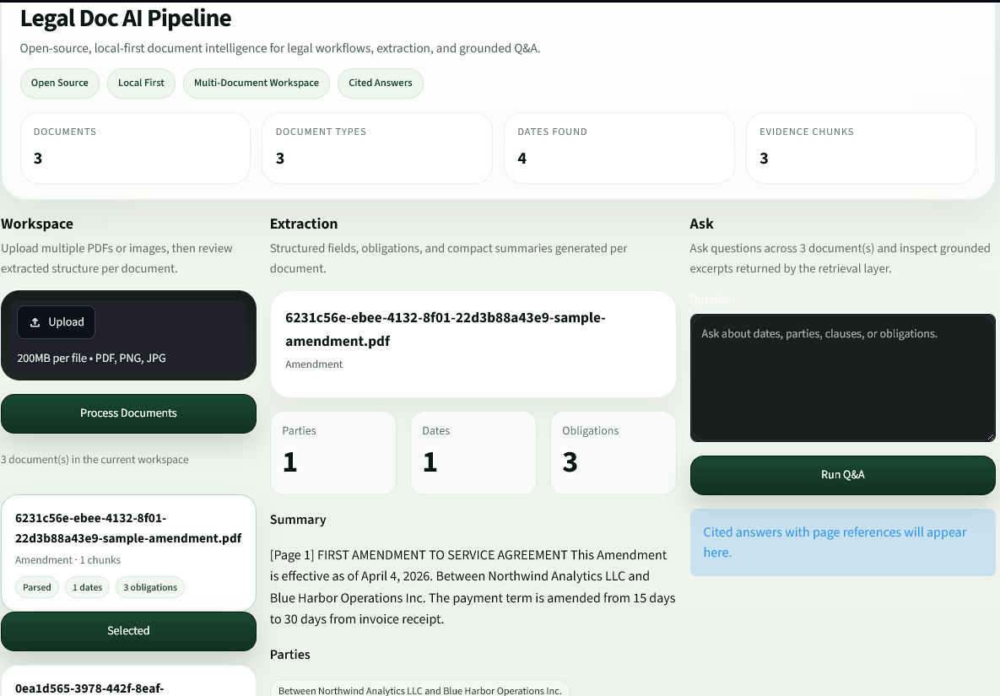
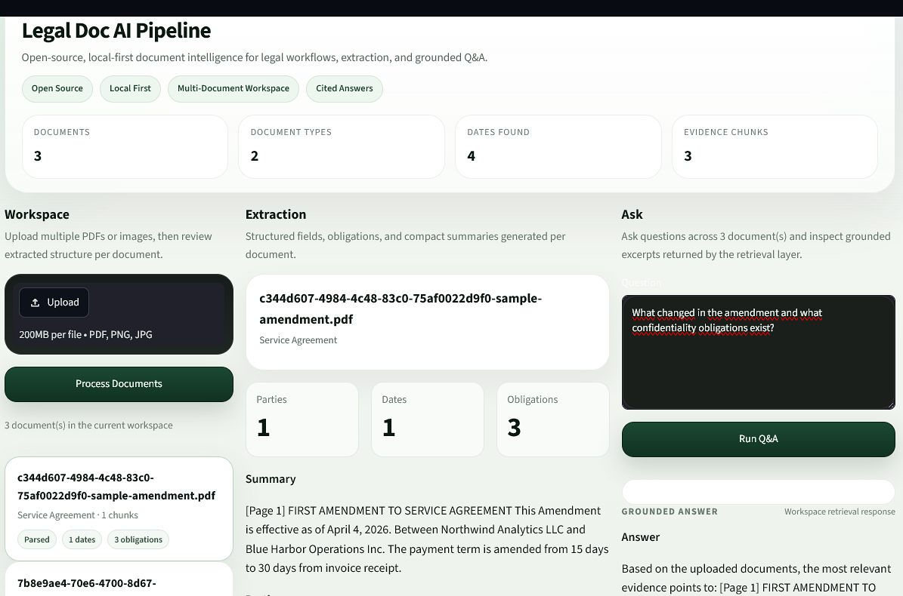

# Legal Doc AI Pipeline

Open-source, local-first document intelligence pipeline for legal workflows, extraction, and grounded Q&A.

This project was built as a portfolio-grade product demo that feels closer to an internal legal operations tool than a toy OCR example.

## What It Does

- Upload multiple PDF or image documents into a shared workspace
- Parse documents into machine-readable text
- Extract legal metadata and key structured signals
- Surface obligations, dates, parties, and summaries
- Run workspace-level Q&A across multiple uploaded files
- Return grounded evidence snippets with source attribution

## Why This Exists

Many AI document demos stop at "upload a file and summarize it." Real document workflows need more:

- multiple documents, not single-file toys
- legal-friendly extraction, not generic text dumps
- local-first architecture, not API-only dependence
- traceable answers tied back to source evidence

This repository is designed to showcase exactly that direction.

## Screenshots

### Workspace Dashboard



### Multi-Document Q&A



## Current Product Scope

The first release is focused on legal and contract-heavy workflows, with room to expand into:

- claims and compliance packs
- policy review
- procurement and vendor paperwork
- invoice and report ingestion
- internal document operations

## Current Features

- Multi-document workspace
- PDF ingestion and parsing
- Image-ready OCR integration layer
- Document type detection
- Parties extraction
- Dates extraction
- Key obligations extraction
- Short document summary generation
- Workspace Q&A with citation cards
- Product-style Streamlit UI for demo and portfolio use

## Example Workflow

1. Upload a service agreement, an amendment, and an NDA
2. Review extracted metadata for each document
3. Ask a cross-document question such as:
   `What changed in the amendment and what confidentiality obligations exist?`
4. Inspect the answer plus grounded source excerpts from more than one document

## Tech Stack

- `FastAPI` for backend APIs
- `Streamlit` for the demo application
- `Docling` integration layer for structured document parsing
- `PaddleOCR` integration layer for OCR fallback
- `pdfplumber` fallback for robust PDF text extraction
- `Pydantic` schemas for workspace and citation models

## Parsing Strategy

The parsing layer is intentionally defensive:

- PDF parsing tries `Docling` first
- if needed, it falls back to `pdfplumber`
- image parsing is structured to use `Docling` and `PaddleOCR`
- the app degrades gracefully if heavy OCR dependencies are unavailable

This makes the demo more stable in local environments while keeping the architecture extensible.

## Project Structure

```text
legal-doc-ai-pipeline/
  app/
    api/            # FastAPI routes
    core/           # shared config
    ingestion/      # parsing and extraction logic
    retrieval/      # Q&A and citation response logic
    schemas/        # Pydantic models
    services/       # storage, OCR, Docling adapters
  data/
    demo_docs/      # generated portfolio demo files
    processed/      # cached workspace state
    uploads/        # uploaded source files
  scripts/
    create_demo_pdf.py
    upload_demo.py
  ui/
    app.py          # Streamlit product UI
```

## Local Run

Create a virtual environment and install dependencies:

```bash
python -m venv .venv
.venv\Scripts\python.exe -m pip install -r requirements.txt
```

Start the backend:

```bash
.venv\Scripts\python.exe -m uvicorn app.main:app --host 127.0.0.1 --port 8000
```

Start the UI:

```bash
.venv\Scripts\python.exe -m streamlit run .\ui\app.py --server.port 8501
```

Open:

- API: `http://127.0.0.1:8000`
- UI: `http://localhost:8501`

## Demo Data

This repo includes helper scripts to generate and upload demo legal documents:

```bash
.venv\Scripts\python.exe .\scripts\create_demo_pdf.py
.venv\Scripts\python.exe .\scripts\upload_demo.py
```

The generated workspace includes:

- a service agreement
- an amendment
- an NDA

## Validation Performed

The current build has been manually validated for:

- backend startup
- UI startup
- multi-document upload
- document type extraction
- dates extraction
- obligations extraction
- workspace Q&A
- multi-citation responses
- selected-document detail flow in the UI

## Known Gaps

- page numbers are not yet fully carried through chunk-level citations
- semantic ranking is still basic and can be improved
- image OCR is wired architecturally, but needs a dedicated image-based validation pass
- the current demo uses generated documents rather than public legal datasets

## Next Improvements

- real page reference propagation
- stronger retrieval ranking
- richer citation highlighting
- better document switching UX
- README screenshots and GIF demo

## Portfolio Positioning

This project is best positioned as:

`Open-source legal document intelligence pipeline with multi-document extraction and grounded Q&A`
